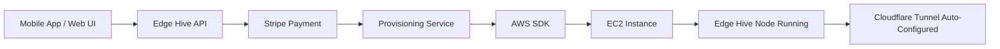

## User Story

**As a** user wanting a managed cloud node
**I want** to provision an AWS instance directly from the app
**So that** I have a persistent edge node in the cloud with zero manual setup

## Technical Specs

### Architecture Overview



### Components

#### 1. Billing API (Stripe)
```rust
// crates/edge-hive-billing/src/lib.rs
pub struct BillingService {
    stripe_client: stripe::Client,
}

impl BillingService {
    pub async fn create_subscription(&self, user_id: &str, plan: Plan) -> Result<Subscription>;
    pub async fn cancel_subscription(&self, subscription_id: &str) -> Result<()>;
    pub async fn get_usage(&self, user_id: &str) -> Result<UsageMetrics>;
}

pub enum Plan {
    Pro,      // $25/mo - 1 node
    Team,     // $100/mo - 5 nodes
    Enterprise, // Custom
}
```

#### 2. Provisioning Service (AWS SDK)
```rust
// crates/edge-hive-cloud/src/provisioner.rs
pub struct AWSProvisioner {
    ec2_client: aws_sdk_ec2::Client,
    route53_client: aws_sdk_route53::Client,
}

impl AWSProvisioner {
    /// Provision a new EC2 instance with Edge Hive pre-installed
    pub async fn provision_node(&self, config: NodeConfig) -> Result<ProvisionedNode> {
        // 1. Launch EC2 instance (t4g.small ARM)
        // 2. Wait for instance to be running
        // 3. Run user-data script to install edge-hive
        // 4. Configure Cloudflare Tunnel
        // 5. Add DNS record
        // 6. Return connection details
    }

    /// Terminate a node
    pub async fn terminate_node(&self, instance_id: &str) -> Result<()>;

    /// List user's nodes
    pub async fn list_nodes(&self, user_id: &str) -> Result<Vec<ProvisionedNode>>;
}

pub struct NodeConfig {
    pub user_id: String,
    pub region: String,       // us-east-1, eu-west-1, etc.
    pub instance_type: String, // t4g.small, t4g.medium
    pub storage_gb: u32,       // 10, 50, 100
}

pub struct ProvisionedNode {
    pub instance_id: String,
    pub public_ip: String,
    pub tunnel_url: String,   // https://node-xxx.edge-hive.io
    pub peer_id: String,
    pub status: NodeStatus,
}
```

#### 3. User Data Script (Auto-Install)
```bash
#!/bin/bash
# /cloud/user-data.sh - Runs on EC2 first boot

set -e

# Install Edge Hive
curl -sSL https://edge-hive.io/install.sh | bash

# Configure with user's token
edge-hive init --cloud-token "${USER_TOKEN}"

# Enable Cloudflare Tunnel
edge-hive tunnel enable --token "${CF_TUNNEL_TOKEN}"

# Start service
systemctl enable edge-hive
systemctl start edge-hive
```

#### 4. Frontend Integration (Svelte)
```svelte
<!-- src/components/CloudNodes.svelte -->
<script>
  import { invoke } from '@tauri-apps/api/core';

  let nodes = $state([]);
  let provisioning = $state(false);

  async function provisionNode() {
    provisioning = true;
    try {
      // Opens Stripe Checkout or uses saved card
      const session = await invoke('create_checkout_session', {
        plan: 'pro',
        returnUrl: window.location.href
      });

      // Redirect to Stripe
      window.location.href = session.url;
    } finally {
      provisioning = false;
    }
  }

  async function loadNodes() {
    nodes = await invoke('list_cloud_nodes');
  }
</script>

<div class="cloud-nodes">
  <h2>☁️ Cloud Nodes</h2>

  {#if nodes.length === 0}
    <div class="empty-state">
      <p>No tienes nodos en la nube aún.</p>
      <button onclick={provisionNode} disabled={provisioning}>
        {provisioning ? 'Procesando...' : '🚀 Crear Nodo Pro ($25/mes)'}
      </button>
    </div>
  {:else}
    <ul>
      {#each nodes as node}
        <li>
          <span class="status {node.status}">{node.status}</span>
          <a href={node.tunnel_url} target="_blank">{node.tunnel_url}</a>
          <button onclick={() => manageNode(node.instance_id)}>⚙️</button>
        </li>
      {/each}
    </ul>
  {/if}
</div>
```

### AWS Infrastructure

| Resource | Purpose | Cost (Pro) |
|----------|---------|------------|
| EC2 t4g.small | Node hosting | ~$12/mo |
| EBS 10GB | Storage | ~$1/mo |
| CloudFront | CDN (optional) | ~$0-2/mo |
| Route 53 | DNS | ~$0.50/mo |
| **Total** | | **~$14-16/mo** |

### API Endpoints

```
POST /api/v1/billing/checkout
  - Creates Stripe checkout session
  - Returns checkout URL

POST /api/v1/nodes/provision
  - Called by Stripe webhook after payment
  - Provisions EC2 instance
  - Returns node details

GET /api/v1/nodes
  - Lists user's cloud nodes

DELETE /api/v1/nodes/:id
  - Terminates a cloud node

POST /api/v1/nodes/:id/restart
  - Restarts a cloud node
```

### Security

- All AWS credentials stored in AWS Secrets Manager
- User tokens are short-lived JWTs
- Stripe webhook signatures verified
- EC2 instances in private VPC with Cloudflare Tunnel only

## Acceptance Criteria

- [ ] User can click "Create Cloud Node" in app
- [ ] Stripe payment flow works (test + live)
- [ ] EC2 instance provisioned within 5 minutes
- [ ] Cloudflare Tunnel auto-configured
- [ ] DNS record created (node-xxx.edge-hive.io)
- [ ] User can see node status in app
- [ ] User can restart/terminate node from app
- [ ] Billing portal accessible from app
- [ ] Usage metrics visible in dashboard

## Branch

`feat/aws-auto-provision`
