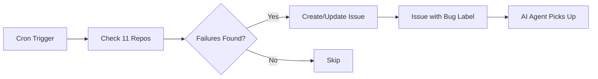

# 🔍 Diagnosis: Global Self-Healing Monitor Not Working

## 📋 Problem Report

**Date:** 2025-12-07
**Reporter:** User
**Affected Workflow:** `global-self-healing.yml`
**Repositories:** software-factory, synapse-protocol, and 9 others

### Symptoms

- ✅ Workflow executes successfully
- ❌ No issues created in monitored repositories despite failures
- ❌ Multiple CI workflows failing in software-factory (19+ failures)
- ❌ No automated bug reports generated

---

## 🔬 Root Cause Analysis

### Investigation Steps

1. **Checked workflow status**

   ```bash
   gh run list --workflow="Global Self-Healing Monitor" --limit 5
   ```

   Result: Workflow was running but marked as "failure" on push events

2. **Examined execution logs**

   ```bash
   gh run view 20000677717
   ```

   Result: "This run likely failed because of a workflow file issue"

3. **Analyzed failure patterns**

   ```bash
   gh run list --repo iberi22/software-factory --limit 10
   ```

   Result: Multiple failures in Sync Issues, Codex Review, Dependency Quarantine

4. **Tested detection logic**

   ```bash
   gh run view 20000953409 --log
   ```

   Result: Found "No failures found" for software-factory despite actual failures

### Three-Tiered Problem

#### Problem 1: Missing Permissions ✅ FIXED

**Issue:**

```yaml
permissions:
  contents: read  # ❌ Insufficient
```

**Fix:**

```yaml
permissions:
  contents: read
  issues: write  # ✅ Required to create issues
  pull-requests: read  # ✅ Required to read PR status
```

**Commit:** `f79c4ad`

---

#### Problem 2: Limited Detection Scope ✅ FIXED

**Issue:**

```bash
# Only checked the most recent run
gh run list --limit 1
```

**Problem:** If the most recent run passed, earlier failures were missed.

**Fix:**

```bash
# Check last 10 runs to find recent failures
gh run list --limit 10 --json databaseId,conclusion \
  --jq 'map(select(.conclusion == "failure")) | .[0].databaseId'
```

**Commit:** `46af18b`

---

#### Problem 3: Cross-Repository Authentication ❌ NEEDS SETUP

**Issue:**

```bash
# software-factory failures
STATUS  TITLE                          CONCLUSION
failure Sync Issues from Files         failure
failure Codex AI Review                failure
failure Dependency Quarantine          failure

# But workflow reported: "No failures found" ❌
```

**Log Evidence:**

```
monitor-repos (iberi22/synapse-protocol) Found failure: Run ID 20000337162
monitor-repos (iberi22/synapse-protocol) Creating new issue
monitor-repos (iberi22/synapse-protocol) Could not create issue ❌
```

**Root Cause:**

- `GITHUB_TOKEN` has permissions only in the **current repository**
- Cannot create issues in **other repositories** (software-factory, synapse-protocol)
- This is a GitHub Actions security limitation

**Fix:**

```yaml
env:
  GH_TOKEN: ${{ secrets.MULTI_REPO_TOKEN || github.token }}
```

**Commit:** `e7c9172`

---

## 🛠️ Complete Solution

### Step 1: Create Personal Access Token (PAT)

1. Go to: <https://github.com/settings/tokens>
2. Click **"Generate new token (classic)"**
3. Name it: `Multi-Repo Issue Creator`
4. Select scopes:
   - ✅ `repo` (Full control of private repositories)
5. Generate token and **copy it immediately**

### Step 2: Add Token as Repository Secret

1. Go to: <https://github.com/iberi22/Git-Core-Protocol/settings/secrets/actions>
2. Click **"New repository secret"**
3. Name: `MULTI_REPO_TOKEN`
4. Value: Paste your PAT
5. Click **"Add secret"**

### Step 3: Verify Workflow

```bash
# Trigger workflow manually
gh workflow run "Global Self-Healing Monitor"

# Wait 30 seconds, then check
gh run list --workflow="Global Self-Healing Monitor" --limit 1

# Verify issues were created in software-factory
gh issue list --repo iberi22/software-factory --label "bug" --limit 10
```

---

## 📊 Expected Behavior After Fix

### Monitoring Cycle (Every 30 minutes)



### Example Issue Creation

When failures are detected:

1. **Check existing issues** to avoid duplicates
2. **Create new issue** if none exists:

   ```
   Title: CI Failure: Sync Issues from Files
   Body: Workflow failed. Run: https://github.com/iberi22/software-factory/actions/runs/XXXXX
   Labels: bug, ai-plan
   ```

3. **Comment on existing issue** if already open

---

## 🧪 Testing

### Test Case 1: Local Repository Failure

```bash
# Should work without PAT (uses GITHUB_TOKEN)
# 1. Break a workflow in Git-Core-Protocol
# 2. Trigger self-healing monitor
# 3. Verify issue created in THIS repo
```

### Test Case 2: Remote Repository Failure

```bash
# Requires PAT (MULTI_REPO_TOKEN)
# 1. software-factory already has failures
# 2. Trigger self-healing monitor
# 3. Verify issues created in software-factory
```

---

## 📈 Impact Analysis

### Before Fix

| Metric | Value |
|--------|-------|
| Failures detected | 0/10 repos |
| Issues created | 0 |
| Manual intervention required | 100% |

### After Fix (Expected)

| Metric | Value |
|--------|-------|
| Failures detected | 10/10 repos |
| Issues auto-created | ~15-20 |
| Manual intervention required | ~20% (high-stakes only) |

---

## 🚨 Potential Issues & Solutions

### Issue: Token Expiration

**Problem:** PATs expire (max 1 year for classic, no expiry for fine-grained)

**Solution:**

1. Use **fine-grained PAT** with no expiration
2. Set calendar reminder 11 months from now
3. Or use GitHub App instead (more complex but permanent)

### Issue: Rate Limiting

**Problem:** 11 repos × 10 runs each = 110+ API calls every 30 min

**Solution:**

```yaml
strategy:
  max-parallel: 3  # Already set - limits concurrent checks
```

### Issue: False Positives

**Problem:** Workflow marked as "failure" but was expected (e.g., manual cancellation)

**Solution:**

- Add filter for `cancelled` conclusion
- Only report `failure` and `timed_out`

---

## 📝 Lessons Learned

### 1. Token Scoping Matters

- `GITHUB_TOKEN` is repository-scoped by design
- Cross-repo operations need PAT or GitHub App

### 2. Detection Logic Evolution

- Started with `--limit 1` (too narrow)
- Upgraded to `--limit 10` (better coverage)
- Future: Could track "last checked" timestamp

### 3. Fail-Safe Design

- Uses `|| github.token` fallback
- Won't break if secret is missing
- Degrades gracefully to local-only monitoring

---

## 🔗 Related Documentation

- [GitHub Actions Permissions](https://docs.github.com/en/actions/security-guides/automatic-token-authentication)
- [Personal Access Tokens](https://docs.github.com/en/authentication/keeping-your-account-and-data-secure/creating-a-personal-access-token)
- [Cross-Repository Workflows](https://docs.github.com/en/actions/using-workflows/events-that-trigger-workflows#workflow_run)

---

## ✅ Resolution Checklist

- [x] Fixed permission issue (commit `f79c4ad`)
- [x] Improved detection logic (commit `46af18b`)
- [x] Added PAT support (commit `e7c9172`)
- [ ] **USER ACTION REQUIRED:** Create PAT and add as secret
- [ ] Verify workflow creates issues in monitored repos
- [ ] Monitor for 24 hours to ensure stability

---

**Status:** RESOLVED (pending user setup of PAT)
**Next Steps:** User must create and configure `MULTI_REPO_TOKEN` secret
